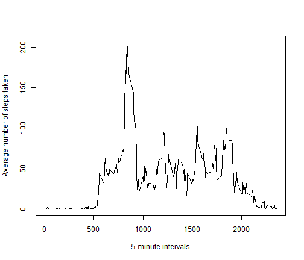
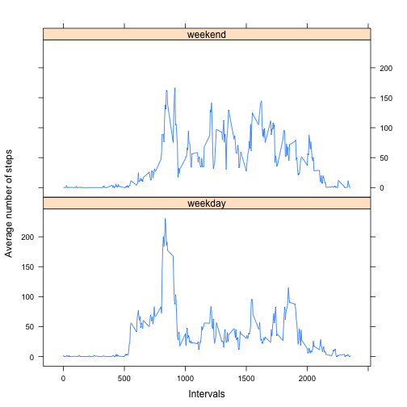

Tracking personal movement with activity monitoring devices
===========================================================

## Introduction

It is now possible to collect a large amount of data about personal movement using activity monitoring devices such as a Fitbit, Nike Fuelband, or Jawbone Up. These type of devices are part of the “quantified self” movement – a group of enthusiasts who take measurements about themselves regularly to improve their health, to find patterns in their behavior, or because they are tech geeks. But these data remain under-utilized both because the raw data are hard to obtain and there is a lack of statistical methods and software for processing and interpreting the data.


## Data

This assignment makes use of data from a personal activity monitoring device. This device collects data at 5 minute intervals through out the day. The data consists of two months of data from an anonymous individual collected during the months of October and November, 2012 and include the number of steps taken in 5 minute intervals each day.

First of all we read in the data from the csv file (located in the working directory), and make sure the columns are transformed to the correct format.

```r
monitoring <- read.csv("activity.csv", header=TRUE, na.strings=c("NA"), colClasses =c("numeric","character","numeric"))
monitoring$date <- as.Date(monitoring$date,"%Y-%m-%d")
options(scipen=999) #no scientific notation
```

## What is mean total number of steps taken per day?

First of all, to understand the distribution of the number of steps the subject took each day, we construct a histogram.

Note: we are ignoring the missing values in the dataset.


```r
totalsteps <- tapply(monitoring$steps,monitoring$date,sum,na.rm = TRUE)
hist(totalsteps,xlab="Steps taken by day",ylab="Frequency",main="Histogram of total number of steps taken each day")
```

 


```r
mean <- mean(totalsteps,na.rm = TRUE)
median <- median(totalsteps,na.rm = TRUE)
```

The mean of the total number of steps is 9354.2295 and the median is 10395, reflecting the highest frequency of total steps in the [10,000; 15,000] bracket with a asymmetric distribution weighted to the left.


## What is the average daily activity pattern?

We create a line chart of the average number of steps taken in each 5-minute interval (averaged across all days). 


```r
averagesteps <- tapply(monitoring$steps,monitoring$interval,mean,na.rm = TRUE)
plot(row.names(averagesteps),averagesteps, xlab="5-minute intervals",type="l", ylab="Average number of steps taken")
```

 


```r
max <- max(averagesteps)
top <- names(which(averagesteps == max(averagesteps)))
```

The 5-minute interval which contains the most steps on average across all days is interval 835 with an average of 206.1698 steps.

## Imputing missing values

Note that there are a number of days/intervals where there are missing values (coded as NA). The presence of missing days may introduce bias into some calculations or summaries of the data.

The number of missing values in the data table by column is listed in below table:


```r
library(xtable)
xt <- colSums(is.na(monitoring))
print(xt,type="html")
```

```
##    steps     date interval 
##     2304        0        0
```

```r
highest <- max(xt)
```

Hence, the total number of rows with missing values is 2304.

To counteract a potential bias of results, we will fill in the missing values in the dataset with the average number of steps during the same 5-minute interval on other days.To preserve the original data, this adapted dataset will be stored under a different name.


```r
monitoring2 <- monitoring
for (i in 1:nrow(monitoring2)) {
 if (is.na(monitoring2$steps[i])){
   monitoring2$steps[i]<-averagesteps[which(row.names(averagesteps)==monitoring2$interval[i])]
 }
}
```

Now we repeat the exploratory analysis we did in the beginning, to see if the results differ.


```r
totalsteps2 <- tapply(monitoring2$steps,monitoring2$date,sum,na.rm = TRUE)
hist(totalsteps2,xlab="Steps taken by day",ylab="Frequency",main="Histogram of total number of steps taken each day")
```

 


```r
mean2 <- mean(totalsteps2)
median2 <- median(totalsteps2)
```

The histogram has a more symmetric distribution compared to the original one. The mean of the total number of steps is now 10766.1887 and the median is 10766.1887. The equality of the mean and median again indicates symmetry of the distribution. This suggests that the initial asymmetry was caused by missing values, as many days had an understated number of total steps.


## Are there differences in activity patterns between weekdays and weekends?

First, we create a new column in the datatable which indicates whether a day is a weekday or a weekend day.


```r
monitoring2$daytype <- factor("weekday", levels=c("weekday","weekend"))
monitoring2$daytype[which(weekdays(monitoring2$date)=="Sunday")] <- "weekend"
monitoring2$daytype[which(weekdays(monitoring2$date)=="Saturday")] <- "weekend"
```

Next, we create a panel plot containing time series of the average numbers steps taken in each interval, averaged across either all weekdays or all weekend days. 


```r
library(lattice)
library(datasets)
library(plyr)
averagesteps2  <-ddply(monitoring2, .(daytype, interval), summarize, steps = mean(steps))
xyplot(steps ~ interval | daytype, data = averagesteps2, type="l",layout = c(1,2),xlab="Intervals",ylab="Average number of steps")
```

 

On weekdays, the highest number of steps is more concentrated in certain intervals, while on weekend days, steps are more equally spread throughout the day. There is also a longer step-less period on weekend days, indicating a longer night's sleep.

